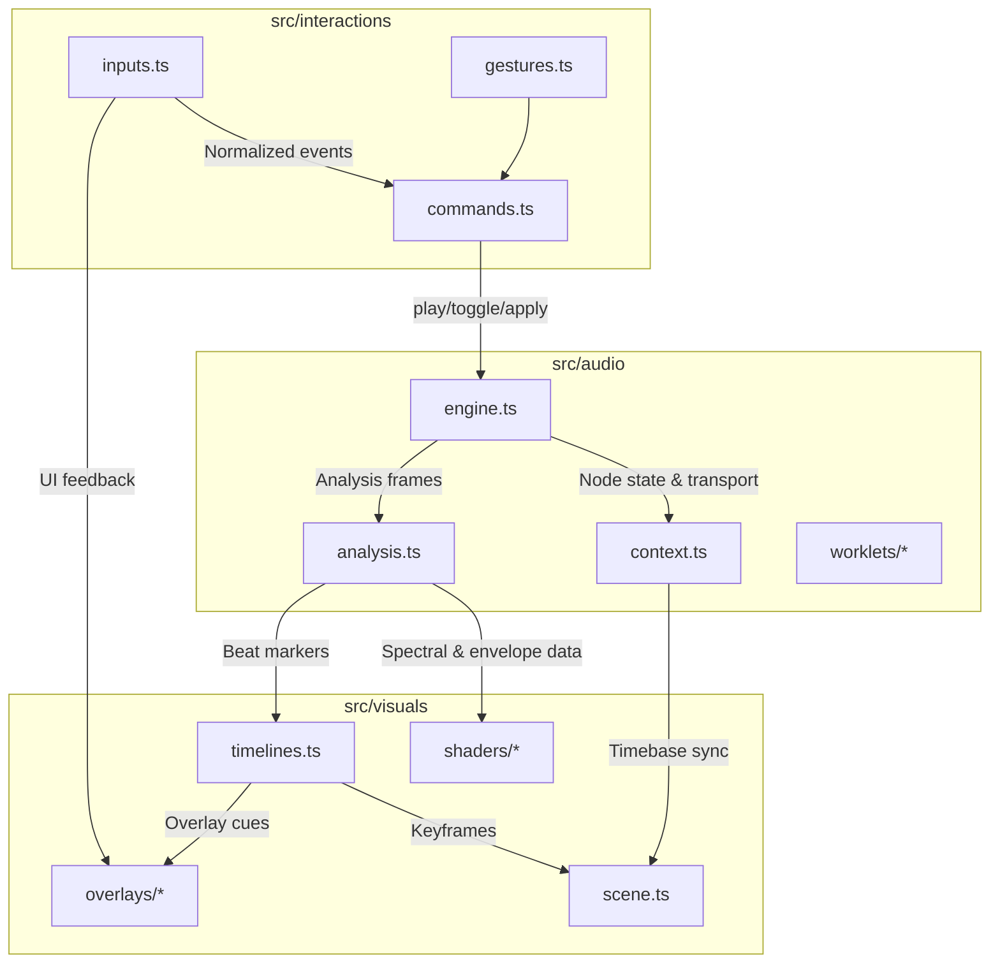

# Technical Architecture Overview

## Audio Processing Plan

The system builds on the Web Audio API with the following core nodes:

- **AudioContext**: Acts as the central timing graph. One shared context is created at app bootstrap and exposed through a lightweight wrapper in `src/audio/context.ts` so both audio scheduling and visualization modules can access transport clock information.
- **GainNode**: Provides master and per-channel gain control. Each synthesizer or sampler voice instantiates its own GainNode, which then feeds a shared master gain node used for global volume automation and mute logic.
- **PannerNode**: Used to position individual sound sources in 3D space. It receives parameter updates from the interaction layer (e.g., cursor position or tracked controllers) so spatial changes stay in sync with visual feedback.
- **ConvolverNode**: Hosts impulse responses for environmental reverb. The audio module maintains a library of IR buffers preloaded during startup, and routes instrument submixes into the convolver when spatial presets demand it.
- **AudioWorklet**: Encapsulates custom DSP routines such as granular synthesis and physics-driven modulation. Worklet processors stream parameter updates via `MessagePort` from the main thread, enabling tight coupling with real-time simulation data.

To accelerate prototyping, the project may optionally integrate **Tone.js**. Tone provides higher-level scheduling, pattern sequencing, and effects chains. When enabled, Tone.js classes wrap the native nodes above; otherwise, a plain Web Audio graph is constructed directly for minimal overhead.

## Rendering Stack

1. **Three.js primary scene**: Owns WebGL context, lighting, and main object graph. Audio-driven uniforms (e.g., amplitude envelopes, spectral data) flow from `src/audio/analysis.ts` into material shaders for beat-synced animations.
2. **p5.js overlays (optional)**: Rendered onto transparent canvases layered above the Three.js canvas. Overlay sketches subscribe to the same analysis stream but focus on 2D HUD elements such as waveform scopes or UI annotations.
3. **GSAP timelines**: Coordinate cross-module animations. Timelines listen to audio events (e.g., section transitions) and input triggers, orchestrating keyframe sequences that affect both Three.js scene nodes and DOM overlays.

### Data Flow

- **Input Handling → Audio Events**: User input modules in `src/interactions` normalize controller, MIDI, and gesture data. They emit high-level commands (`playNote`, `toggleScene`, `applyEffect`) dispatched to `src/audio/engine.ts`, which schedules Web Audio node parameter updates or note events.
- **Audio Events → Visual Updates**: The audio engine publishes analysis frames (FFT magnitudes, envelopes, beat markers) through a shared observable. `src/visuals` components subscribe to this stream to drive shader uniforms, camera motion, and overlay transitions.
- **Input Handling → Visual Updates**: Interaction handlers also send immediate feedback messages to visual modules for responsive UI cues (highlighting controls, showing tooltips) even before audio responses propagate.

## Module Communication Diagram

### Communication Contracts

- **Interactions → Audio**: Promise-based command handlers returning success state and optional payloads (e.g., note IDs). Commands must be idempotent and resilient to rapid retriggering.
- **Interactions → Visuals**: EventEmitter channels carrying typed payloads for hover, select, and drag states. Visual modules listen for these events to adjust UI affordances.
- **Audio → Visuals**: Read-only observables emitting immutable analysis snapshots. Subscribers are expected to treat each frame as ephemeral and avoid mutating shared state.
- **Shared Utilities**: `src/shared` (future) will host data schemas and TypeScript interfaces (`AudioEvent`, `VisualCue`, `InteractionCommand`) ensuring compile-time contract enforcement across modules.
